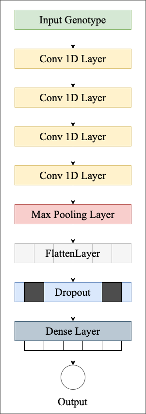

## Predicting Phenotypes From Novel Genomic Markers Using Deep Learning

NovGMDeep is a one-dimensional deep convolutional neural network model for genomic selection. It predicts phenotypes using novel genomic markers to reduce the curse of high dimensionality of SNP data. The model avoids overfitting by applying the convolutional, pooling and dropout layers hence decreasing the complexity caused by a large number of genomic markers. We trained and evaluated the model on Arabidopsis thaliana and Oryza sativa samples using K-Fold cross-validation. The prediction accuracy is evaluated using Pearson’s correlation coefficient (PCC), Mean absolute error (MAE), and Standard deviation of MAE. The predicted results for the phenotypes showed a higher correlation when the model was trained with SVs and TEs than with SNPs. 

#### NovGMDeep Architecture   
<p align="center">

</p>    

## Installation
Ensure you have Python 3.9 installed. Install required packages using:
```
pip install -r requirements.txt
```

## Data
- Access the full VCF variant files containing structural variants data for A. thaliana samples from the [European Variation Archive](https://www.ebi.ac.uk/ena/browser/view/ERZ1458872?show=analyses) (PRJEB38975).
- Download the [zipped folder](https://drive.google.com/file/d/1iW-Hv3iYa8KJBEnoBhxz3j0jWLebC0la/view?usp=drive_link) containing CSV files with structural variants data: 'Deletions.csv', 'Duplications.csv', and 'Inversions.csv'.
- Phenotype data for Flowering time of A. thaliana samples can be found in the file ["FT10_arabi.csv"](path/to/FT10_arabi.csv).


## Usage
1. Data Preprocessing
> Select high-quality genotypes: Refer to `quality_based_selection.ipynb`. \
> Prepare data for model input: Refer to `data_processing.ipynb`.

2. Data Split
> Split training and testing datasets: Execute `sv_data_split.py`. 

3. Train the Model
> Train the model: Execute `sv_model_train.py`. 

4. Test the Model
> Test the trained model: Execute `sv_model_train.py`.


## Citation
If you use this work in your research, please cite:
```
@article{sehrawat2023predicting,
  title={Predicting phenotypes from novel genomic markers using deep learning},
  author={Sehrawat, Shivani and Najafian, Keyhan and Jin, Lingling},
  journal={Bioinformatics Advances},
  volume={3},
  number={1},
  pages={vbad028},
  year={2023},
  publisher={Oxford University Press}
}
```
